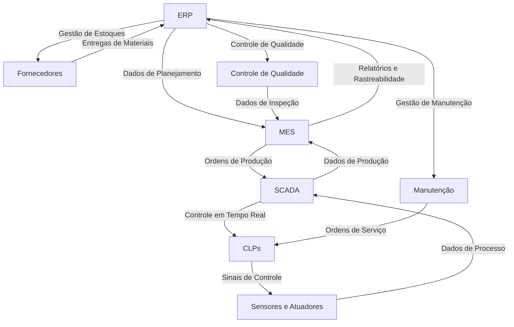

## Levantamento de Módulos e Integrações

```mermaid
graph TD

    A[ERP] -->|Dados de Planejamento| B[MES]
    B -->|Ordens de Produção| C[SCADA]
    C -->|Controle em Tempo Real| D[CLPs]
    D -->|Sinais de Controle| E[Sensores e Atuadores]
    E -->|Dados de Processo| C
    C -->|Dados de Produção| B
    B -->|Relatórios e Rastreabilidade| A
    A -->|Gestão de Estoques| F[Fornecedores]
    F -->|Entregas de Materiais| A
    A -->|Gestão de Manutenção| G[Manutenção]
    G -->|Ordens de Serviço| D
    A -->|Controle de Qualidade| H[Controle de Qualidade]
    H -->|Dados de Inspeção| B 
```