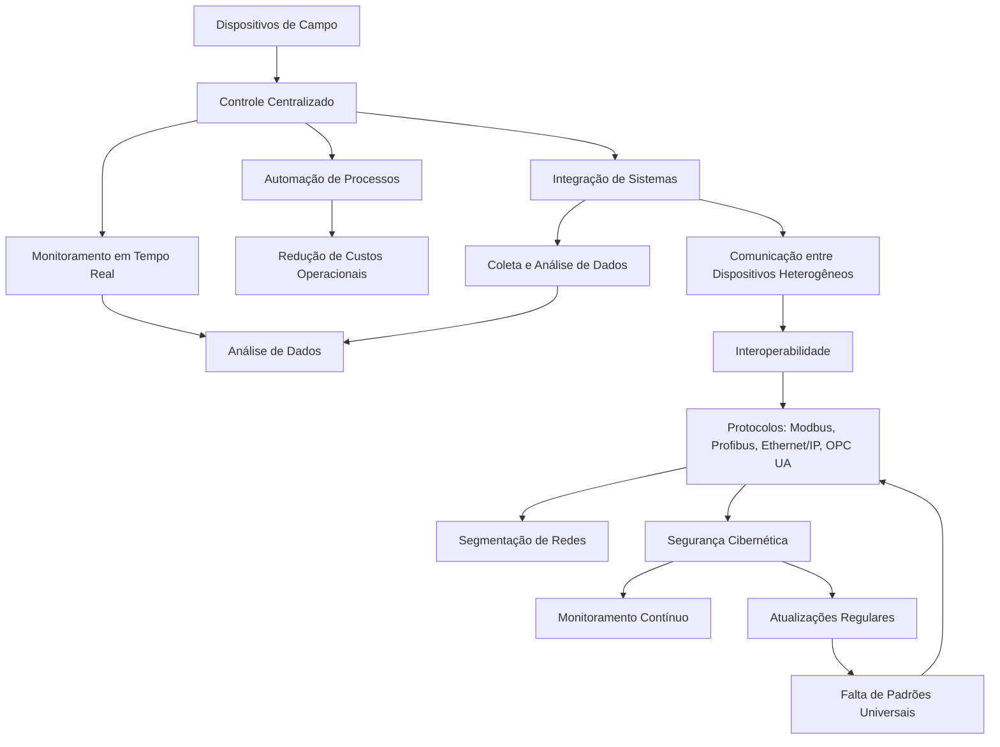

# Relatório sobre Redes Industriais

## Introdução
As redes industriais são fundamentais para a automação e integração de sistemas em ambientes industriais. Elas permitem a comunicação entre dispositivos, máquinas e sistemas de controle, promovendo eficiência, produtividade e inovação. Este relatório aborda os benefícios, desafios e protocolos das redes industriais, além de discutir medidas de segurança, escolha de protocolos e impactos esperados.

---

## Benefícios da Implementação

### Eficiência
- **Automação de processos**: Reduz a necessidade de intervenção humana, minimizando erros e aumentando a velocidade de produção.
- **Monitoramento em tempo real**: Permite o acompanhamento contínuo de máquinas e processos, facilitando a tomada de decisões.
- **Integração de sistemas**: Conecta diferentes setores da indústria, como produção, logística e manutenção, em uma única rede.

### Automação
- **Controle centralizado**: Possibilita o gerenciamento de múltiplos dispositivos a partir de um único ponto.
- **Redução de custos operacionais**: Diminui o desperdício de recursos e otimiza o uso de energia.

### Integração de Sistemas
- **Comunicação entre dispositivos heterogêneos**: Facilita a interoperabilidade entre equipamentos de diferentes fabricantes.
- **Coleta e análise de dados**: Permite a criação de insights para melhorias contínuas.

---

## Desafios Enfrentados

### Interoperabilidade
- **Diversidade de protocolos**: A existência de múltiplos protocolos pode dificultar a comunicação entre dispositivos.
- **Falta de padrões universais**: Nem todos os equipamentos seguem os mesmos padrões de comunicação.

### Segurança
- **Vulnerabilidades cibernéticas**: Redes industriais são alvos frequentes de ataques, como ransomware e espionagem.
- **Falta de atualizações**: Muitos sistemas industriais utilizam tecnologias antigas, que não recebem atualizações de segurança.

### Custo
- **Investimento inicial**: A implementação de redes industriais pode exigir altos custos em infraestrutura e treinamento.
- **Manutenção**: A complexidade das redes requer profissionais especializados para sua manutenção.

---

## Protocolos Disponíveis

### Protocolos Comuns
1. **Modbus**: Amplamente utilizado por sua simplicidade e compatibilidade com diversos dispositivos.
2. **Profibus**: Ideal para automação de processos e controle de dispositivos de campo.
3. **Ethernet/IP**: Baseado em Ethernet, é adequado para aplicações que exigem alta velocidade e integração com sistemas de TI.
4. **OPC UA**: Focado em segurança e interoperabilidade, é uma escolha moderna para integração de sistemas.

### Adequação por Aplicação
- **Manufatura**: Ethernet/IP e Profibus são comuns devido à alta velocidade e confiabilidade.
- **Energia e Utilidades**: Modbus é frequentemente utilizado por sua simplicidade e baixo custo.
- **Indústria 4.0**: OPC UA é preferido por sua segurança e capacidade de integração com sistemas de nuvem.

---

## Discussão e Conclusões

### 1. Segurança
Para melhorar a segurança das redes industriais, as seguintes medidas podem ser adotadas:
- **Segmentação de redes**: Isolar sistemas críticos para limitar o impacto de possíveis ataques.
- **Atualizações regulares**: Manter sistemas e dispositivos atualizados com os patches de segurança mais recentes.
- **Monitoramento contínuo**: Utilizar ferramentas de detecção de intrusões e análise de tráfego para identificar ameaças em tempo real.

### 2. Escolha do Protocolo
Considerando um setor de manufatura, o **Ethernet/IP** é o protocolo mais adequado devido à sua alta velocidade, integração com sistemas de TI e suporte a aplicações complexas. Ele permite a automação eficiente e a coleta de dados em tempo real, essenciais para a produtividade.

### 3. Benefícios Esperados
Uma rede industrial bem planejada contribui para:
- **Produtividade**: Automação e monitoramento contínuo reduzem tempos de inatividade e aumentam a eficiência.
- **Qualidade**: A coleta e análise de dados permitem identificar e corrigir falhas rapidamente.
- **Inovação**: A integração com tecnologias emergentes, como IoT e IA, abre caminho para novos modelos de negócios e processos.

## Protocolo OCPP (Open Charge Point Protocol)

### Introdução
O **OCPP** (Open Charge Point Protocol) é um protocolo aberto amplamente utilizado para a comunicação entre pontos de carregamento de veículos elétricos (EVs) e plataformas de gestão de rede de carregamento. Desenvolvido inicialmente pela empresa **Hubject**, o OCPP visa padronizar a comunicação entre infraestrutura de carregamento e sistemas de back-end, garantindo interoperabilidade, flexibilidade e escalabilidade para redes de recarga de veículos elétricos.

O OCPP é utilizado principalmente em estações de recarga para veículos elétricos e é compatível com diferentes tipos de hardware e software. Esse protocolo permite uma comunicação bidirecional entre o ponto de carregamento (conhecido como "Charge Point") e a plataforma de gestão (conhecida como "Central System").

---

### Arquitetura do OCPP
O OCPP adota uma arquitetura cliente-servidor, onde os pontos de carregamento (clientes) enviam solicitações de dados para um sistema centralizado (servidor). Esse sistema pode fornecer comandos e informações de status de forma a permitir a gestão eficiente de uma rede de estações de carregamento.

- **Charge Point (Ponto de Carregamento)**: É o dispositivo responsável por carregar os veículos elétricos e enviar informações sobre o estado do carregamento, como erros, progresso e status da conexão.
- **Central System (Sistema Central)**: Responsável por gerenciar as estações de recarga, processar transações e fornecer comandos para controlar as estações, como autorizar ou interromper carregamentos.

---

### Funcionalidades do OCPP
1. **Autenticação de Usuários**: O OCPP permite que os usuários se autentiquem utilizando diversos métodos, como cartões RFID ou aplicativos móveis. A comunicação entre o ponto de carregamento e o sistema central valida se o usuário está autorizado a realizar o carregamento.
  
2. **Gerenciamento de Carregamento**: O protocolo oferece comandos que permitem iniciar, interromper ou modificar o carregamento de um veículo. Também é possível obter informações sobre o estado do carregamento, como tempo restante e consumo de energia.
  
3. **Monitoramento e Diagnóstico Remoto**: O OCPP permite que o sistema central monitore o status e desempenho de cada ponto de carregamento, detectando falhas ou problemas e gerando alertas.

4. **Gestão de Tarifas e Cobrança**: O protocolo facilita a coleta de dados de consumo de energia, possibilitando o cálculo de tarifas e emissão de faturas para os usuários.

5. **Comunicação em Tempo Real**: A comunicação entre os pontos de carregamento e o sistema central é realizada em tempo real, o que permite a atualização imediata dos estados das estações e a resposta rápida a incidentes.

---

### Versões do OCPP
O OCPP passou por várias versões, cada uma trazendo melhorias em termos de funcionalidade e segurança. As versões mais comuns são:

1. **OCPP 1.2**: A primeira versão do protocolo, que estabeleceu a base para a comunicação entre estações de recarga e sistemas de gestão. Sua simplicidade facilitou a adoção inicial do protocolo.
  
2. **OCPP 1.5**: Introduziu melhorias como a capacidade de monitoramento de status e a introdução de novos tipos de mensagens para facilitar a comunicação de erros e eventos.

3. **OCPP 2.0**: A versão 2.0 trouxe uma série de melhorias, como a inclusão de recursos de segurança mais robustos, maior flexibilidade no gerenciamento de sessões de carregamento e suporte a comunicação via WebSocket. Esta versão também oferece maior controle sobre as configurações do ponto de carregamento, como controle remoto de potência e verificação de status de faturas.

4. **OCPP 2.0.1**: Uma versão subsequente que corrigiu alguns problemas de segurança e introduziu melhorias no gerenciamento de eventos e transações.

---

### Vantagens do OCPP
- **Interoperabilidade**: O OCPP permite a comunicação entre estações de diferentes fabricantes, proporcionando um ecossistema flexível e interconectado.
- **Escalabilidade**: O protocolo é altamente escalável, o que significa que ele pode ser utilizado em redes de carregamento de diferentes tamanhos, desde pequenas instalações até grandes redes de carregamento.
- **Flexibilidade**: O OCPP pode ser facilmente adaptado a diferentes cenários de carregamento, com a capacidade de suportar uma variedade de dispositivos de hardware.
- **Facilidade de Integração**: Por ser um protocolo aberto, o OCPP facilita a integração com sistemas de gestão de terceiros, como sistemas de faturamento e plataformas de gerenciamento de energia.

---

### Desafios e Considerações
- **Segurança**: Embora o OCPP 2.0 tenha introduzido melhorias de segurança, a comunicação entre os pontos de carregamento e os sistemas centrais ainda pode ser vulnerável a ataques cibernéticos, como interceptação de dados e ataques DDoS. As implementações devem garantir criptografia adequada e proteção contra vulnerabilidades.
- **Padronização**: Apesar de ser um protocolo aberto, a falta de padronização completa pode resultar em desafios de interoperabilidade, especialmente quando novos dispositivos ou sistemas entram no mercado.
- **Atualizações e Compatibilidade**: A adoção de versões mais recentes do OCPP pode ser dificultada pela necessidade de atualizar o hardware existente, o que pode gerar custos e impactos nas operações.

---

### Conclusão
O OCPP é um protocolo essencial para a comunicação em redes de carregamento de veículos elétricos, permitindo a interoperabilidade entre diferentes dispositivos e sistemas de gestão. Sua evolução contínua e a introdução de novos recursos de segurança e flexibilidade fazem dele uma escolha robusta para ambientes de carregamento modernos. No entanto, como qualquer sistema de comunicação industrial, é crucial considerar os desafios de segurança e integração ao adotar o OCPP em um ambiente de produção.

---

## Diagrama de Integração de Sistemas

