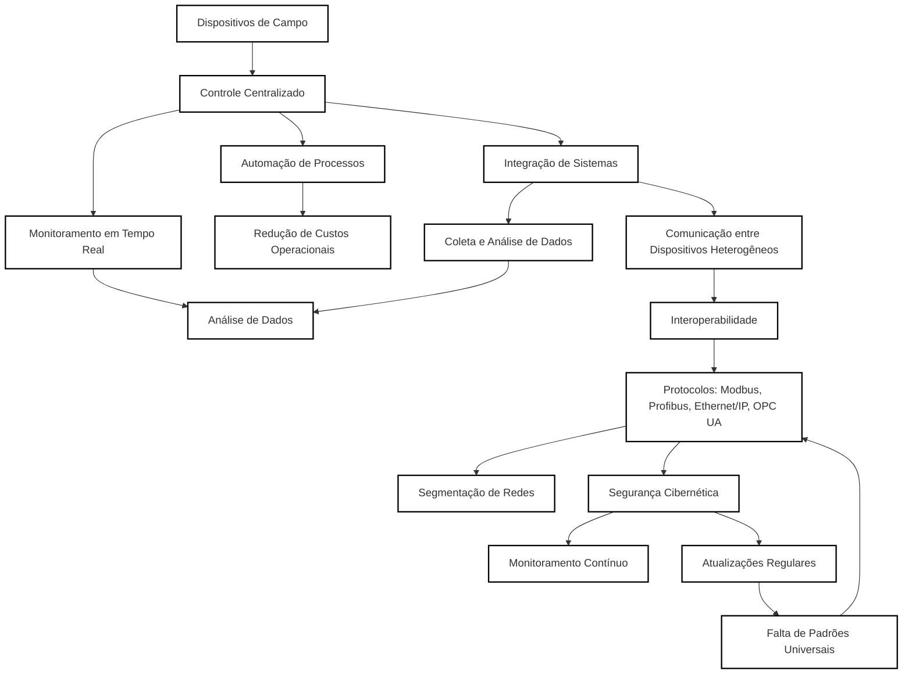

# Relatório sobre Redes Industriais

## Introdução
As redes industriais são fundamentais para a automação e integração de sistemas em ambientes industriais. Elas permitem a comunicação entre dispositivos, máquinas e sistemas de controle, promovendo eficiência, produtividade e inovação. Este relatório aborda os benefícios, desafios e protocolos das redes industriais, além de discutir medidas de segurança, escolha de protocolos e impactos esperados.

---

## Benefícios da Implementação

### Eficiência
- **Automação de processos**: Reduz a necessidade de intervenção humana, minimizando erros e aumentando a velocidade de produção.
- **Monitoramento em tempo real**: Permite o acompanhamento contínuo de máquinas e processos, facilitando a tomada de decisões.
- **Integração de sistemas**: Conecta diferentes setores da indústria, como produção, logística e manutenção, em uma única rede.

### Automação
- **Controle centralizado**: Possibilita o gerenciamento de múltiplos dispositivos a partir de um único ponto.
- **Redução de custos operacionais**: Diminui o desperdício de recursos e otimiza o uso de energia.

### Integração de Sistemas
- **Comunicação entre dispositivos heterogêneos**: Facilita a interoperabilidade entre equipamentos de diferentes fabricantes.
- **Coleta e análise de dados**: Permite a criação de insights para melhorias contínuas.

---

## Desafios Enfrentados

### Interoperabilidade
- **Diversidade de protocolos**: A existência de múltiplos protocolos pode dificultar a comunicação entre dispositivos.
- **Falta de padrões universais**: Nem todos os equipamentos seguem os mesmos padrões de comunicação.

### Segurança
- **Vulnerabilidades cibernéticas**: Redes industriais são alvos frequentes de ataques, como ransomware e espionagem.
- **Falta de atualizações**: Muitos sistemas industriais utilizam tecnologias antigas, que não recebem atualizações de segurança.

### Custo
- **Investimento inicial**: A implementação de redes industriais pode exigir altos custos em infraestrutura e treinamento.
- **Manutenção**: A complexidade das redes requer profissionais especializados para sua manutenção.

---

## Protocolos Disponíveis

### Protocolos Comuns
1. **Modbus**: Amplamente utilizado por sua simplicidade e compatibilidade com diversos dispositivos.
2. **Profibus**: Ideal para automação de processos e controle de dispositivos de campo.
3. **Ethernet/IP**: Baseado em Ethernet, é adequado para aplicações que exigem alta velocidade e integração com sistemas de TI.
4. **OPC UA**: Focado em segurança e interoperabilidade, é uma escolha moderna para integração de sistemas.

### Adequação por Aplicação
- **Manufatura**: Ethernet/IP e Profibus são comuns devido à alta velocidade e confiabilidade.
- **Energia e Utilidades**: Modbus é frequentemente utilizado por sua simplicidade e baixo custo.
- **Indústria 4.0**: OPC UA é preferido por sua segurança e capacidade de integração com sistemas de nuvem.

---

## Discussão e Conclusões

### 1. Segurança
Para melhorar a segurança das redes industriais, as seguintes medidas podem ser adotadas:
- **Segmentação de redes**: Isolar sistemas críticos para limitar o impacto de possíveis ataques.
- **Atualizações regulares**: Manter sistemas e dispositivos atualizados com os patches de segurança mais recentes.
- **Monitoramento contínuo**: Utilizar ferramentas de detecção de intrusões e análise de tráfego para identificar ameaças em tempo real.

### 2. Escolha do Protocolo
Considerando um setor de manufatura, o **Ethernet/IP** é o protocolo mais adequado devido à sua alta velocidade, integração com sistemas de TI e suporte a aplicações complexas. Ele permite a automação eficiente e a coleta de dados em tempo real, essenciais para a produtividade.

### 3. Benefícios Esperados
Uma rede industrial bem planejada contribui para:
- **Produtividade**: Automação e monitoramento contínuo reduzem tempos de inatividade e aumentam a eficiência.
- **Qualidade**: A coleta e análise de dados permitem identificar e corrigir falhas rapidamente.
- **Inovação**: A integração com tecnologias emergentes, como IoT e IA, abre caminho para novos modelos de negócios e processos.

---

## Diagrama de Integração de Sistemas

